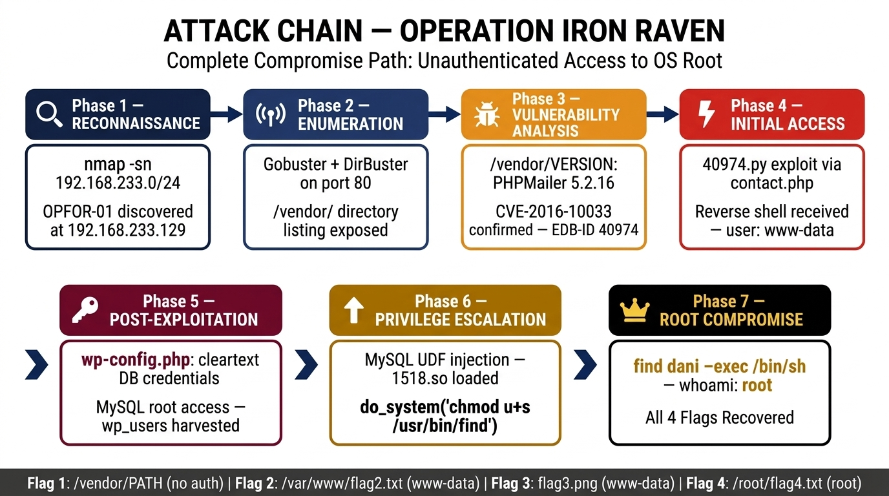
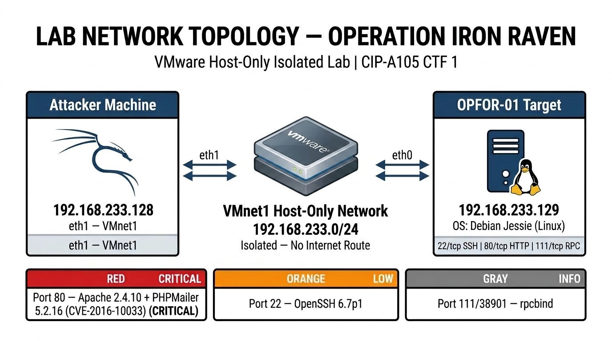

<p align="center">
  
</p>

<h1 align="center">🦅 OPERATION IRON RAVEN</h1>

<p align="center">
  <b>Offensive Security Operations II — CTF 1 Penetration Test Report</b><br/>
  <sub>ICDFA Academy · CIP-A105 · Summative Competency Exam</sub>
</p>

<p align="center">
  
  
  
  
  
</p>

---

## 📋 Overview

This repository contains the complete deliverables for **Operation Iron Raven** — an authorised, black-box penetration test conducted against a standalone intentionally-vulnerable Linux server (**OPFOR-01**) as part of the ICDFA Offensive Security Operations II competency examination.

The engagement was executed entirely within an **isolated VMware Host-Only network** with no route to the public internet. All reconnaissance, enumeration, vulnerability research, exploitation, post-exploitation, privilege escalation, and flag recovery were performed independently in a single session.

> **Outcome:** Total system compromise — from unauthenticated network access to full `root` shell — with all four mission flags recovered.

---

## 🗂️ Repository Contents

| # | File | Description |
|:-:|:-----|:------------|
| 📄 | [`Operation_Iron_Raven_Report.pdf`](Operation_Iron_Raven_Report.pdf) | **Main Technical Report** — 83-page report covering all 12 required sections: reconnaissance, enumeration, exploitation, post-exploitation, privilege escalation, findings, remediation, and full evidence appendices with 42 annotated screenshots. |
| 📊 | [`Executive_Report.pdf`](Executive_Report.pdf) | **Executive Summary** — 3-page non-technical leadership briefing summarising the outcome, business risks, and recommended immediate actions. |
| 📋 | [`Risk_Register.pdf`](Risk_Register.pdf) | **Risk Register** — 7 confirmed findings documented with Likelihood × Impact scoring, technical descriptions, and recommended controls in a card-per-finding layout. |
| 📝 | [`Lessons_Learned.pdf`](Lessons_Learned.pdf) | **Lessons-Learned Statement** — Reflective analysis covering key technical insights, 7 documented failed hypotheses, and improvements for future operations. |
| ✅ | [`ROE_Acknowledgement.pdf`](ROE_Acknowledgement.pdf) | **Rules of Engagement Acknowledgement** — Signed compliance record confirming adherence to all operational boundaries and the pre-operation checklist. |
| 🖼️ | [`network_topology.jpg`](network_topology.jpg) | **Lab Network Topology Diagram** — Visual representation of the isolated VMnet1 Host-Only subnet architecture. |
| 🖼️ | [`attack_chain.jpg`](attack_chain.jpg) | **Attack Kill Chain Diagram** — 7-phase attack path from unauthenticated enumeration to OS root compromise. |

---

## 🔗 Attack Chain

```
 ┌─────────────┐    ┌─────────────┐    ┌────────────────┐    ┌──────────────┐
 │    RECON     │───▶│ ENUMERATION │───▶│  VULN ANALYSIS │───▶│INITIAL ACCESS│
 │  nmap scan   │    │  Gobuster   │    │ PHPMailer 5.2.16│    │  EDB-40974   │
 │  Host found  │    │  /vendor/   │    │ CVE-2016-10033 │    │  Rev shell   │
 └─────────────┘    └─────────────┘    └────────────────┘    └──────┬───────┘
                                                                    │
 ┌─────────────┐    ┌─────────────┐    ┌────────────────┐          │
 │    ROOT     │◀───│  PRIV ESC   │◀───│POST-EXPLOIT    │◀─────────┘
 │  whoami:root │    │ SUID find   │    │ wp-config.php  │
 │  4/4 Flags  │    │ UDF inject  │    │ MySQL as root  │
 └─────────────┘    └─────────────┘    └────────────────┘
```

---

## 🏁 Mission Objectives

All four flags were successfully recovered:

| Flag | Location | Access Level Required | Method |
|:----:|:---------|:---------------------:|:-------|
| **Flag 1** | `/var/www/html/vendor/PATH` | Unauthenticated | Directory listing enumeration |
| **Flag 2** | `/var/www/flag2.txt` | `www-data` | Reverse shell filesystem access |
| **Flag 3** | `wp-content/uploads/2018/11/flag3.png` | `www-data` | WordPress uploads directory traversal |
| **Flag 4** | `/root/flag4.txt` | `root` | SUID privilege escalation via `find` |

---

## 🔍 Confirmed Findings

| ID | Vulnerability | Severity | Risk Score |
|:--:|:-------------|:--------:|:----------:|
| FIND-01 | Insecure Directory Listing — `/vendor/` Exposed | 🟡 **Medium** | 40/100 |
| FIND-02 | PHPMailer 5.2.16 RCE — CVE-2016-10033 | 🔴 **Critical** | 100/100 |
| FIND-03 | Cleartext Database Credentials in `wp-config.php` | 🟠 **High** | 81/100 |
| FIND-04 | WordPress User Password Hashes Accessible | 🟠 **High** | 64/100 |
| FIND-05 | MySQL Service Running as OS `root` | 🔴 **Critical** | 100/100 |
| FIND-06 | MySQL UDF Injection — Arbitrary Command Execution | 🔴 **Critical** | 90/100 |
| FIND-07 | SUID `find` Binary — Root Shell Escalation | 🔴 **Critical** | 100/100 |

---

## 🌐 Lab Architecture

<p align="center">
  
</p>

| Component | Details |
|:----------|:--------|
| **Attacker** | Kali Linux — `192.168.233.128` (eth1) |
| **Target** | OPFOR-01 / Debian Jessie — `192.168.233.129` |
| **Network** | VMnet1 Host-Only — `192.168.233.0/24` |
| **Isolation** | No internet route · No bridged adapters |

---

## 🛠️ Tools & Techniques

| Phase | Tools Used |
|:------|:-----------|
| Reconnaissance | `nmap`, `netdiscover` |
| Enumeration | `Gobuster`, `DirBuster`, manual HTTP browsing |
| Vulnerability Research | Exploit-DB, CVE databases, version fingerprinting |
| Exploitation | EDB-ID 40974 (Python), `nc` reverse shell listener |
| Post-Exploitation | `cat`, `find`, `mysql` CLI, manual filesystem traversal |
| Privilege Escalation | MySQL UDF injection (`1518.so`), SUID `find` binary abuse |

---

## 📌 Key Takeaways

- **Enumeration depth is decisive** — discovering `/vendor/VERSION` reduced an open-ended search to a single high-confidence attack vector in under 10 minutes.
- **Compounding misconfigurations amplify risk non-linearly** — neither the PHPMailer RCE alone nor the MySQL root misconfiguration alone would have enabled full compromise; together they formed a devastating chain.
- **Failed hypotheses are valuable data** — 7 approaches were tested and explicitly falsified, demonstrating systematic methodology over trial-and-error.
- **Staging infrastructure must be verified** — three failed `wget` attempts before the HTTP server was running were avoidable with a pre-flight checklist.

---

## ⚠️ Disclaimer

This penetration test was conducted as part of an **authorised academic exercise** under strict Rules of Engagement. All activities were performed within an **isolated virtual lab environment** with no connection to production systems or the public internet. This repository is published for educational and assessment purposes only.

> **Classification:** Training Use Only

---

<p align="center">
  <b>Daniyal Ahmed</b> · C11/26/EHIT/17331<br/>
  Offensive Security Operations II · CIP-A105 · September 2026
</p>
