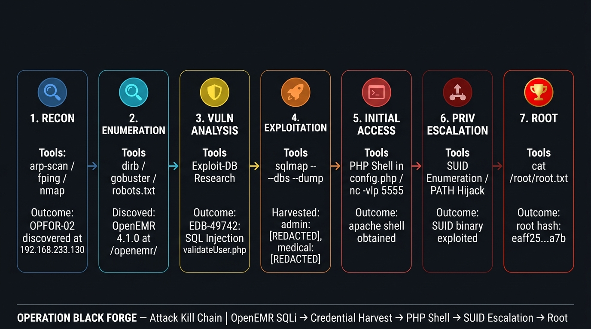
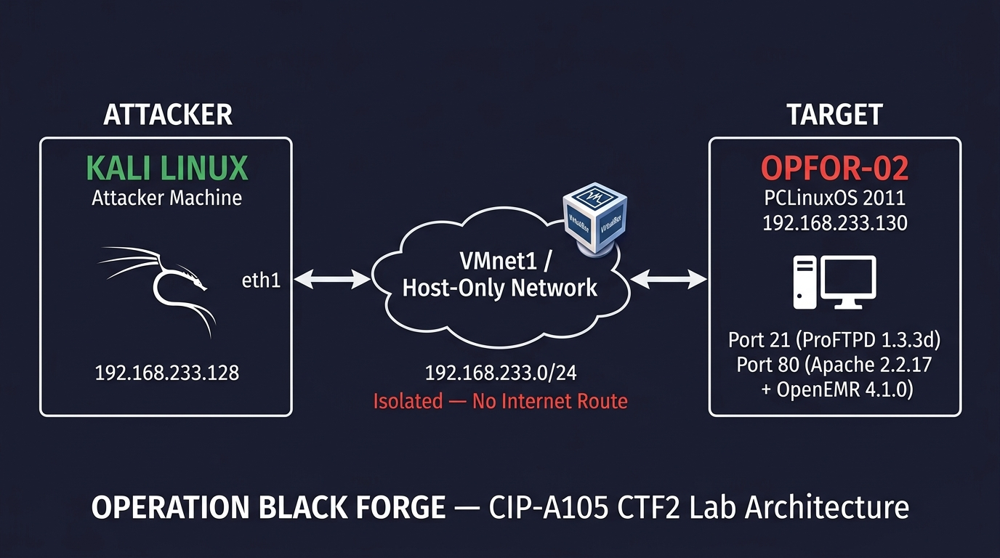

<p align="center">
  
</p>

<h1 align="center">⚒️ OPERATION BLACK FORGE</h1>

<p align="center">
  <b>Offensive Security Operations II — CTF 2 Penetration Test Report</b><br/>
  <sub>ICDFA Academy · CIP-A105 · Summative Competency Exam</sub>
</p>

<p align="center">
  
  
  
  
  
</p>

---

## 📋 Overview

This repository contains the complete deliverables for **Operation Black Forge** — an authorised, black-box penetration test conducted against **OPFOR-02** — an intermediate-level intentionally vulnerable Linux server running **OpenEMR 4.1.0** (a healthcare Electronic Medical Records application), as part of the ICDFA Offensive Security Operations II CTF 2 competency examination (50% of final grade).

The engagement was executed entirely within an **isolated VirtualBox Host-Only network** with no route to the public internet. All reconnaissance, enumeration, vulnerability research, exploitation, post-exploitation, privilege escalation, and root access were performed independently in a single session.

> **Outcome:** Total system compromise — from unauthenticated network access through SQL injection, credential harvesting, PHP shell injection, and SUID privilege escalation to full `root` shell.

---

## 🗂️ Repository Contents

| # | File | Description |
|:-:|:-----|:------------|
| 📄 | [`Operation_Black_Forge_Report.pdf`](Operation_Black_Forge_Report.pdf) | **Main Technical Report** — Complete 12-section report covering reconnaissance, enumeration, SQL injection exploitation, credential harvesting, PHP shell injection, SUID privilege escalation, findings, remediation, and full evidence appendices with 30 annotated screenshots. |
| 📊 | [`Executive_Report.pdf`](Executive_Report.pdf) | **Executive Summary** — Non-technical leadership briefing summarising the engagement outcome, attack chain, business risks, and recommended immediate actions. |
| 📋 | [`Risk_Register.pdf`](Risk_Register.pdf) | **Risk Register** — 6 confirmed findings documented with Likelihood × Impact scoring, technical descriptions, and recommended controls in a card-per-finding layout. |
| 📝 | [`Lessons_Learned.pdf`](Lessons_Learned.pdf) | **Lessons-Learned Statement** — Reflective analysis covering key technical insights, documented failed hypotheses, and improvements for future operations. |
| 🖼️ | [`network_topology.jpg`](network_topology.jpg) | **Lab Network Topology Diagram** — Visual representation of the isolated VirtualBox Host-Only network architecture. |
| 🖼️ | [`attack_chain.jpg`](attack_chain.jpg) | **Attack Kill Chain Diagram** — 7-phase attack path from unauthenticated enumeration to OS root compromise. |

---

## 🔗 Attack Chain

```
 ┌─────────────┐    ┌─────────────┐    ┌────────────────┐    ┌──────────────┐
 │    RECON     │───▶│ ENUMERATION │───▶│  VULN ANALYSIS │───▶│ EXPLOITATION │
 │  arp-scan   │    │ dirb/gobust │    │ OpenEMR 4.1.0  │    │  sqlmap SQLi │
 │  nmap -sCV  │    │  /openemr/  │    │  EDB-49742     │    │  DB dumped   │
 └─────────────┘    └─────────────┘    └────────────────┘    └──────┬───────┘
                                                                     │
 ┌─────────────┐    ┌─────────────┐    ┌────────────────┐           │
 │    ROOT     │◀───│  PRIV ESC   │◀───│ INITIAL ACCESS │◀──────────┘
 │  whoami:root│    │  SUID PATH  │    │ config.php     │
 │ root hash   │    │  HIJACKING  │    │ PHP rev shell  │
 └─────────────┘    └─────────────┘    └────────────────┘
```

---

## 🔍 Confirmed Findings

| ID | Vulnerability | Severity | Risk Score |
|:--:|:-------------|:--------:|:----------:|
| FIND-01 | Insecure Directory Listing — Information Disclosure | 🟡 **Medium** | 30/100 |
| FIND-02 | OpenEMR 4.1.0 SQL Injection — EDB-49742 | 🔴 **Critical** | 100/100 |
| FIND-03 | Weak Credentials and Legacy MD5 Password Hashing | 🟠 **High** | 81/100 |
| FIND-04 | Authenticated Arbitrary PHP File Edit via Admin Panel | 🔴 **Critical** | 90/100 |
| FIND-05 | SUID Binary PATH Hijacking — Privilege Escalation | 🔴 **Critical** | 80/100 |
| FIND-06 | ProFTPD 1.3.3d — Outdated Service with Known CVEs | 🟠 **High** | 56/100 |

---

## 🌐 Lab Architecture

<p align="center">
  
</p>

| Component | Details |
|:----------|:--------|
| **Attacker** | Kali Linux — `192.168.233.128` (eth1) |
| **Target** | OPFOR-02 / PCLinuxOS 2011 — `192.168.233.130` |
| **Network** | VMnet1 Host-Only — `192.168.233.0/24` |
| **Hypervisor** | VirtualBox |
| **Isolation** | No internet route · No bridged adapters |

---

## 🛠️ Tools & Techniques

| Phase | Tools Used |
|:------|:-----------|
| Reconnaissance | `nmap`, `arp-scan`, `fping` |
| Enumeration | `dirb`, `gobuster`, manual HTTP browsing, `robots.txt` |
| Vulnerability Research | Exploit-DB (EDB-49742), CVE databases, version fingerprinting |
| Exploitation | `sqlmap` boolean-based blind SQL injection |
| Credential Harvesting | `awk` CSV parsing, online MD5 hash cracker |
| Initial Access | PHP reverse shell injected via OpenEMR admin file editor, `nc` listener |
| Post-Exploitation | `uname -a`, `find` SUID enumeration, manual filesystem traversal |
| Privilege Escalation | SUID binary PATH hijacking (environment variable manipulation) |

---

## 📌 Key Takeaways

- **Enumeration reveals hidden attack surfaces** — a "Coming Soon" homepage concealed an entire OpenEMR application that was the sole entry point to full compromise.
- **SQL injection remains devastating in 2026** — a single injectable parameter yielded the complete application database and all user credentials.
- **Compounding weaknesses create catastrophic chains** — weak MD5 hashing + weak passwords + file editor = unauthenticated to root in one session.
- **SUID binaries require absolute paths** — PATH hijacking is a well-documented but still-prevalent escalation technique that should be audited on every Linux system.
- **Defence in depth would have disrupted the chain** — a WAF, strong passwords, or file-system permissions alone would have blocked full compromise.

---

## ⚠️ Disclaimer

This penetration test was conducted as part of an **authorised academic exercise** under strict Rules of Engagement. All activities were performed within an **isolated virtual lab environment** with no connection to production systems or the public internet. This repository is published for educational and assessment purposes only.

> **Classification:** Training Use Only

---

<p align="center">
  <b>Daniyal Ahmed</b> · C11/26/EHIT/17331<br/>
  Offensive Security Operations II · CIP-A105 · September 2026
</p>
